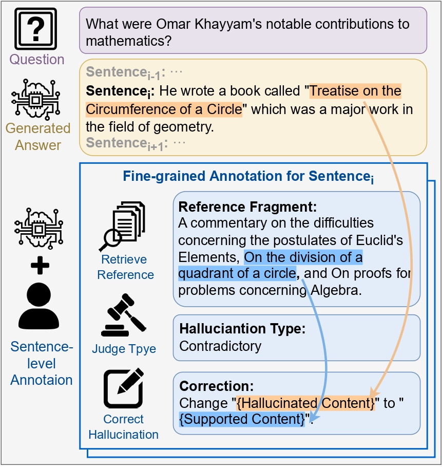
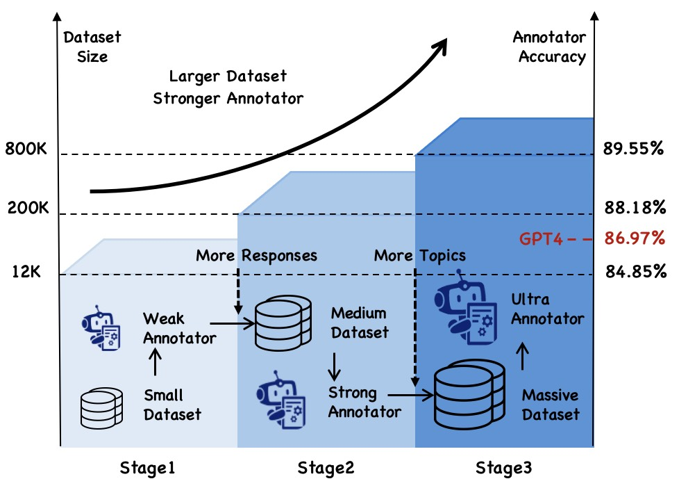
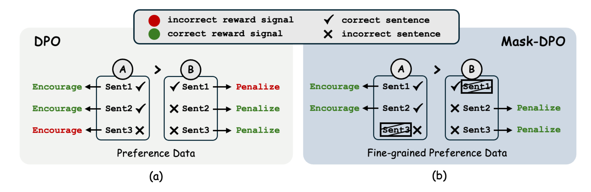

# ANAH

[](./LICENSE)

This is the repository for our ANAH series of papers, which aims to reduce hallucinations in LLM through research involving benchmarking, detection, and mitigation of hallucinations:

- **[Benchmark]** [ANAH: Analytical Annotation of Hallucinations in Large Language Models](https://arxiv.org/abs/2405.20315)
- **[Detection]** [ANAH-v2: Scaling Analytical Hallucination Annotation of Large Language Models](https://arxiv.org/abs/2407.04693)
- **[Mitigation]** [Mask-DPO: Generalizable Fine-grained Factuality Alignment of LLMs]()

The repo contains:

+ The [data](#huggingface-dataset) for training and evaluating the LLM which consists of sentence-level hallucination annotations.
+ The [model](#huggingface-model) for annotating the hallucination.
+ The [code](#evaluation) for evaluating the hallucinations level of LLM-generated content and the LLMs' ability to annotate hallucination.
+ The [code](#maskdpo-training) for performing fine-grained factuality alignment.

## 🚀 What's New
- **[2025.01.23]** Mask-DPO has been accepted by the ICLR 2025. 🎉🎉🎉
- **[2024.09.26]** ANAH-v2 has been accepted by the NeurIPS 2024. 🎉🎉🎉
- **[2024.07.12]** ANAH-v2 [Annotator](https://huggingface.co/opencompass/anah-v2) has been open-sourced. 🔥🔥🔥
- **[2024.07.03]** ANAH [Annotator-7B](https://huggingface.co/opencompass/anah-7b) & [20B](https://huggingface.co/opencompass/anah-20b) have been open-sourced.  🔥🔥🔥
- **[2024.05.16]** ANAH has been accepted by the main conference of ACL 2024. 🎉🎉🎉


## ✨ Introduction

### ANAH: Analytical Annotation of Hallucinations in Large Language Models

[](https://arxiv.org/abs/2405.20315)

ANAH is a bilingual dataset that offers analytical annotation of hallucinations in LLMs within generative question answering.

Each answer sentence in our dataset undergoes rigorous annotation, involving the retrieval of a reference fragment, the judgment of the hallucination type, and the correction of hallucinated content.

ANAH consists of ~12k sentence-level annotations for ~4.3k LLM responses covering over 700 topics, constructed by a human-in-the-loop pipeline.


<p align="center">
  
</p>

### ANAH-v2: Scaling Analytical Hallucination Annotation of Large Language Models

[](https://arxiv.org/abs/2407.04693)


ANAH-v2 is a scalable framework for the oversight of LLM hallucinations.

Through iterative self-training, we simultaneously and progressively scale up the hallucination annotation dataset and improve the accuracy of the hallucination annotator.

The final dataset encompasses both over ∼3k topics, ∼196k model responses, and ∼822k annotated sentences, in English and Chinese.

The final hallucination annotator (detector) with only 7B parameters surpasses the performance of GPT-4 and obtains new state-of-the-art hallucination detection results on HaluEval and HalluQA by zero-shot inference.

<p align="center">
  
</p>

## Mask-DPO: Generalizable Fine-grained Factuality Alignment of LLMs

[]()

Mask-DPO is a fine-grained factuality alignment method based on Direct Preference Optimization (DPO).

Incorporating sentence-level factuality as mask signals, Mask-DPO only learns from factually correct sentences in the preferred samples and prevents the penalty on factual contents in the not preferred samples, which resolves the ambiguity in the preference learning.


<p align="center">
  
</p>

## 🤗 HuggingFace Model & Dataset
<a name="huggingface-dataset"></a>
### Dataset

The ANAH dataset is available on Huggingface dataset hub.

| Dataset | Huggingface Repo |
|---------|------------------|
| ANAH    | [Dataset Link](https://huggingface.co/datasets/opencompass/anah) |

We also release the topics, questions and reference documents of ANAH-v2, you can find it [here](https://github.com/open-compass/ANAH/blob/main/eval/anah_v2/question_document.jsonl).

<a name="huggingface-model"></a>
### Model

ANAH can be used for training hallucination annotators. 

We have trained the annotators based on InternLM2 series models.

The annotator models are available on Huggingface model hub.

| Model    | Huggingface Repo |
|----------|------------------|
| ANAH-7B  | [Model Link](https://huggingface.co/opencompass/anah-7b)  |
| ANAH-20B | [Model Link](https://huggingface.co/opencompass/anah-20b)  |
| ANAH-v2  | [Model Link](https://huggingface.co/opencompass/anah-v2) |


You have to follow the prompt in our paper to annotate the hallucination. Note that ANAH and ANAH-v2 use completely different prompts.

We recommand you to use the more advanced annotator ANAH-v2 and its prompt can be found [here](https://github.com/open-compass/ANAH/blob/main/prompt_v2.py).

We also provide some [examples](https://github.com/open-compass/ANAH/blob/main/example) of using the ANAH-v2 annotator, which you can refer to for annotating your content.

<a name="evaluation"></a>

## 🏗️ ️Evaluation for the hallucinations level of LLM-generated content.

ANAH-v2 is a nice hallucination annotator that can be used to assess the level of hallucinations in LLM-generated content.

### 1. Responses Generation

For the models you want to evaluate, collect their responses under some questions. We recommend that you use the questions from the [ANAH-v2 dataset](https://github.com/open-compass/ANAH/blob/main/eval/anah_v2/question_document.jsonl), but you can also use your custom questions. Then, construct your model response file in the following format:

```json
{"question": "...", "response": "..."}
{"question": "...", "response": "..."}
```


### 2. Hallucination Score Evaluation

Put the path to the model response file you just got into `{your_model_response_path}`. Then run the following command. You can get the hallucination annotation result in `{your_annotation_result_path}` and the factuality score (higher score means lower level of hallucination) in `{your_evaluation_result_path}`.

```bash
python -u ./eval/anah_v2/eval.py \
    --json_path {your_model_response_path} \ 
    --annotation_path {your_annotation_result_path} \
    --eval_path {your_evaluation_result_path} \
```

Note that if you are using the customized questions, you will need to prepare a `question_document` file to be entered as `--document_path`. You can refer to the format of [this file](https://github.com/open-compass/ANAH/blob/main/eval/anah_v2/question_document.jsonl) to organize your file.

## 🏗️ ️Evaluation for LLMs' ability to generate fine-grained hallucination annotation.

ANAH can be used for evaluating the current open-source and close-source LLMs' ability to generate fine-grained hallucination annotation.

### 1. Environment Setup

We recommend you use `Python 3.10` and `Pytorch 1.13.1`.

```bash
conda create --name anah python=3.10.13
conda activate anah
pip install -r requirements.txt
```

### 2. Inference and Evaluation

We now support the evaluation of the InternLM2, Llama2, Qwen, and Baichuan2 series of open-source models.

We use LMdeploy for model deployment and inference. If you want to test more models, you can refer to [LMDeploy](https://github.com/InternLM/lagent) for relevant configuration.

We recommend you download the huggingface model to your local path and replace the `{your_hf_model_path}` to that path.

Our evaluations are conducted on NVIDIA A100 GPUs, and OOM may occur on other types of machines.

```bash
python -u ./eval/anah_v1/eval.py \
    --model_type {your_model_type} \ 
    --server_addr {your_hf_model_path} \
    --json_path {test_set_path} \
    --output_path {your_inference_results_path} \
    --eval_sorce_path {your_evaluation_result_path} \
```

<a name="maskdpo-training"></a>
## 🚄 Factuality Alignment Tutorial

### 1. Install Dependencies

Mask-DPO utilizes [XTuner](https://github.com/InternLM/xtuner) as the training engine.

```bash
conda env create -f maskdpo.yml 
```

### 2. Prepare Fine-grained Preference Data

You need to prepare sentence-level facutality preference data in the following format:

```json
{
    "prompt": [{"role": "user", "content": "..."}],
    "chosen": [{"role": "assistant", "content": "..."}],
    "chosen_item": {
        "sents": ["sent1", "sent2", "..."],
        "type": ["hallucination", "no_hallucination", "..."]
    },
    "rejected": [{"role": "assistant", "content": "..."}],
    "rejected_item": {
        "sents": ["sent1", "sent2", "..."],
        "type": ["hallucination", "no_hallucination", "..."]
    }
}
```

where `chosem_item` is the fine-grained factual information about `chosem`, `sents` is a sentence-level slice of the `content` in `chosen`, and `type` is the hallucination situation of the corresponding sentence.
`rejected_item` is the same.

We recommend you to use [ANAH-v2](https://huggingface.co/opencompass/anah-v2) for fine-grained hallucination annotation of your data. Of course you can use other methods as well.


### 3. Training

After putting the data and initial model paths to the corresponding locations in config, you can use the following command to train the model.

```bash
python -m torch.distributed.run \
  --nproc_per_node=4 \
  --nnodes=1 \
  --node_rank=0 \
  --rdzv_id=1234 \
  --rdzv_backend=c10d \
  --rdzv_endpoint=127.0.0.1:1234 \
  ./maskdpo/train.py \
  ./maskdpo/example_config.py \
  --deepspeed deepspeed_zero3 \
  --launcher pytorch
```

## ❤️ Acknowledgements

ANAH is built with [InternLM](https://github.com/InternLM/InternLM), [Xtuner](https://github.com/InternLM/xtuner) and [LMDeploy](https://github.com/InternLM/lagent). Thanks for their awesome work!

## 🖊️ Citation

If you find this project useful in your research, please consider citing:
```
@article{ji2024anah,
  title={ANAH: Analytical Annotation of Hallucinations in Large Language Models},
  author={Ji, Ziwei and Gu, Yuzhe and Zhang, Wenwei and Lyu, Chengqi and Lin, Dahua and Chen, Kai},
  journal={arXiv preprint arXiv:2405.20315},
  year={2024}
}

@article{gu2024anah,
  title={ANAH-v2: Scaling Analytical Hallucination Annotation of Large Language Models},
  author={Gu, Yuzhe and Ji, Ziwei and Zhang, Wenwei and Lyu, Chengqi and Lin, Dahua and Chen, Kai},
  journal={arXiv preprint arXiv:2407.04693},
  year={2024}
}

@inproceedings{gumask,
  title={Mask-DPO: Generalizable Fine-grained Factuality Alignment of LLMs},
  author={Gu, Yuzhe and Zhang, Wenwei and Lyu, Chengqi and Lin, Dahua and Chen, Kai},
  booktitle={The Thirteenth International Conference on Learning Representations}
}
```

## 💳 License

This project is released under the Apache 2.0 [license](./LICENSE).
